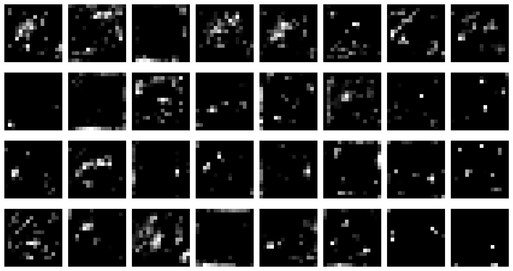
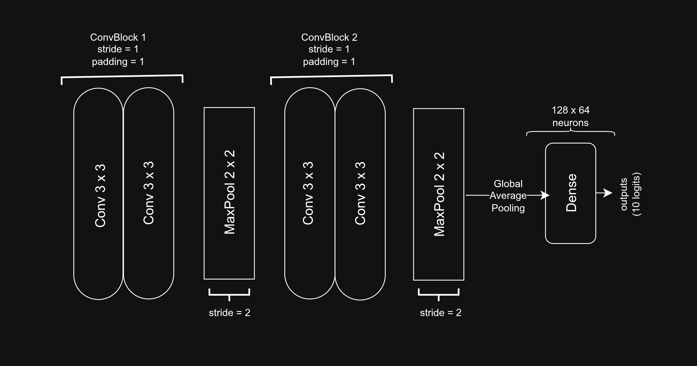
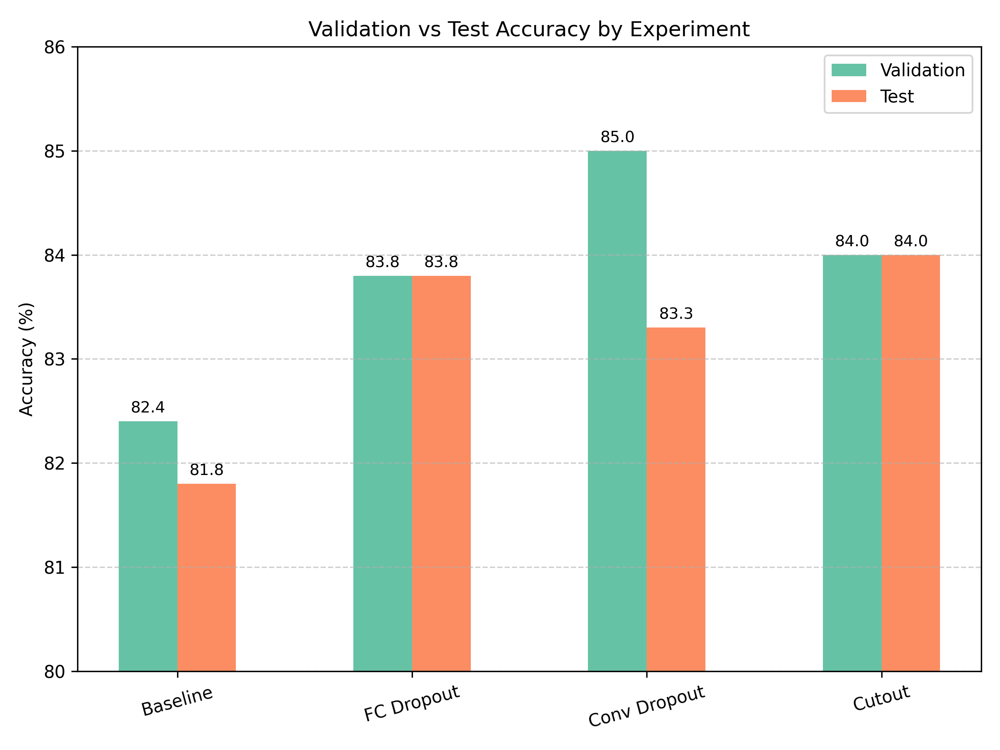
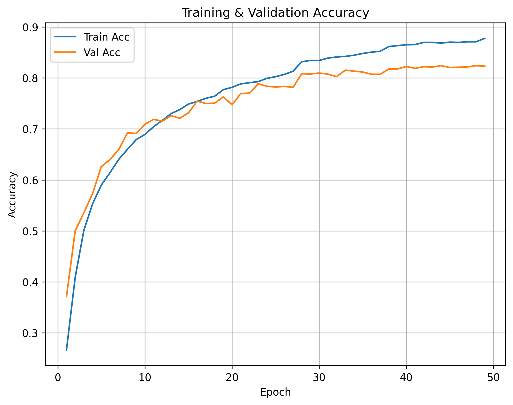
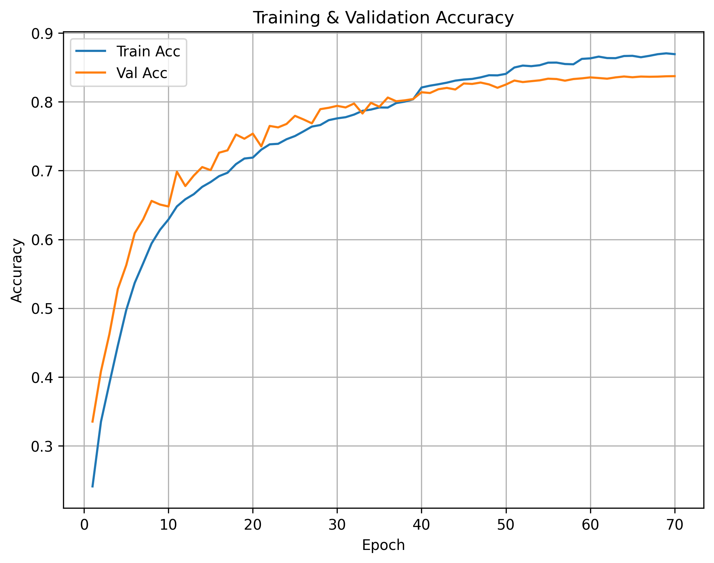
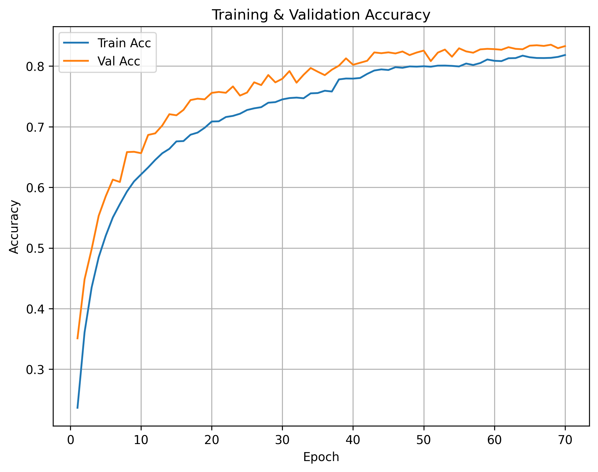

# Cutout v. Dropout
*“Exploring dropout regularization and cutout augmentation in CNNs on CIFAR-10.”*

<p align="center">
  
  <br>
  <em>Figure 1: Feature map visualization under conv dropout. 
  Dropout introduces a “pepper and salt” activation pattern.</em>
</p>
- It's activation distribution is relayed in `notebooks/README`.

---

## 🔹 Overview
This project explores the impact of **dropout** and **cutout** on model generalization in a lightweight CNN trained on CIFAR-10.



We test:
- Dropout applied to the fully connected layers  
- Dropout applied to the convolutional layers  
- Cutout augmentation applied to the baseline CNN  

Both dropout and cutout improved accuracy by ~2–3% compared to baseline.

<p align="center">
  
  <br>
  <em>Figure 2: Validation and test accuracy comparison across experiments.</em>
</p>

---

## 🔹 Results Summary
| Experiment           | Val Acc (%) | Test Acc (%) | Notes                     |
|----------------------|-------------|--------------|---------------------------|
| Baseline             | 82.4        |  81.8        | No dropout, standard aug  |
| Baseline + Cutout    | 84.0        |  84.0        | Cutout size = 8           |
| FC Dropout           | 83.7        |  83.8        | Dropout p=0.5             |
| Conv Dropout         | 85.0        |  83.3        | Dropout p=0.1             |

> Multiple dropout probabilities and cutout sizes were tested. Only the best settings are shown here.\
> For full details, see the respective notebooks in `notebooks/`.

**Takeaway:** Dropout in convolutional layers gave the highest validation accuracy, while cutout matched dropout in test accuracy.

<p align="center">
  
  
  
  <br>
  <em>Figure 3: Curves displaying the effects of strong regularization on model accuracy.</em>
</p>

---

## 🔹 How to Run
- Dataset must be downloaded and saved to `data`.
- Dataset available @: [https://drive.google.com/file/d/1oSkCmcEaqFNfeKGOH9IwFuK9YOoWiCMQ/view?usp=drive_link]

1. Clone repo  
   ```bash
   git clone https://github.com/fw7th/regularization-ml.git
   cd regularization-ml
   ```
2. Install dependencies
   ```bash
   pip install -r requirements.txt
   ```
3. Open notebooks in notebooks/ folder
- Start with 01_baseline.ipynb

## 🔹 Dataset
- Dataset: CIFAR-10 
- Baseline data augmentations applied to the training set:
    - Random crop
    - Color jitter
    - Random horizontal flip
    - ImageNet normalization  

## 🔹 Citations
@article{devries2017cutout,
  title={Improved Regularization of Convolutional Networks with Cutout},
  author={DeVries, Terrance and Taylor, Graham W},
  journal={arXiv preprint arXiv:1708.04552},
  year={2017}
}

- Model weights available @: [https://drive.google.com/drive/folders/1e9uG825xt6FS12kankDSHI_ZETO-ke-o?usp=drive_link]
