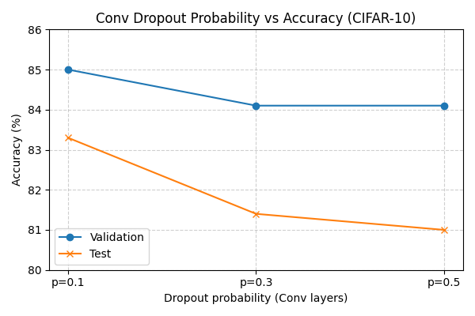
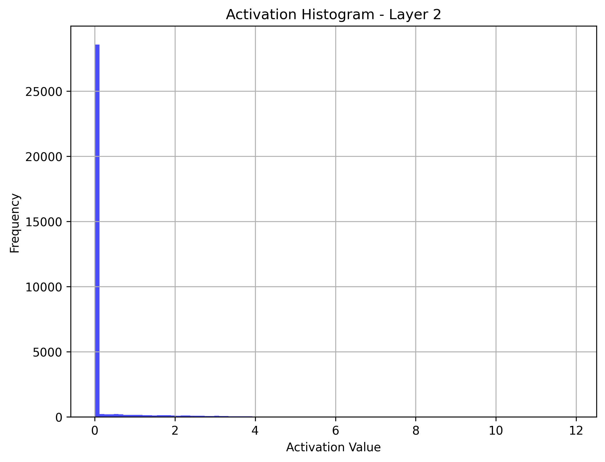
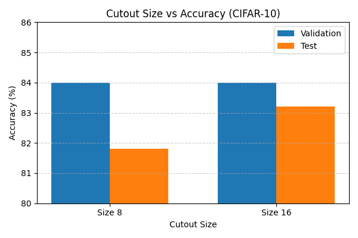
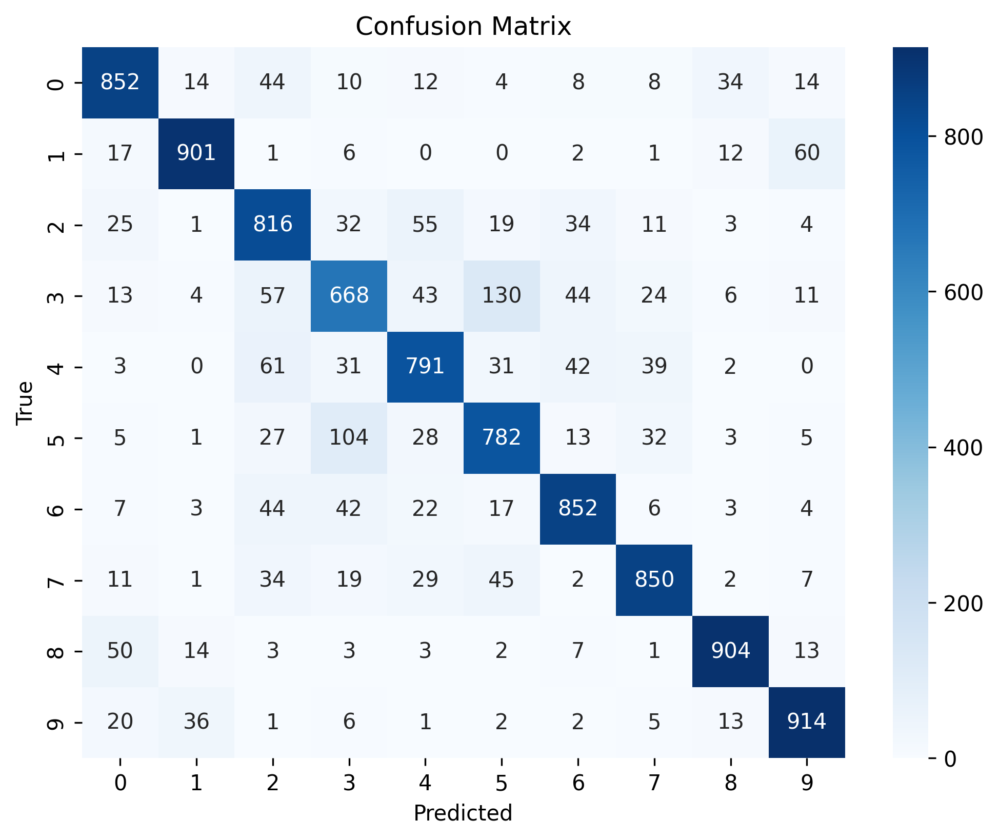

# Notebooks Guide
This folder contains all experiment notebooks. Each notebook isolates one idea, but together they show the progression of experiments.

---

## 📂 Notebooks Guide
### **01_baseline.ipynb**  
- **Setup:** Baseline CNN with standard augmentations only.  
- **Result:** Val 82.4% / Test 81.8%  

### **02_fc_dropout.ipynb**  
- **Setup:** Dropout applied only to fully connected layers.  
- **Result:** Val 83.8% / Test 83.7%  

  
   
  <em>Figure 1: Accuracy vs dropout probability.</em>

### **03_conv_dropout.ipynb**  
- **Setup:** Dropout applied to convolutional layers.  
- **Result:** Val 85.0% / Test 83.3%  
- **Observation:** Strongest regularization effect; higher validation accuracy, slightly weaker test generalization.  

  
  
   
  <em>Figure 2: Figure 1: (Left) Accuracy vs dropout probability for conv dropout. (Right) Activation histogram showing zeroed outputs under dropout.</em>.</em>

### **04_cutout.ipynb**  
- **Setup:** Cutout augmentation applied to the baseline CNN.  
- **Result:** Val 84.0% / Test 84.0%  
- **Observation:** Cutout matched or exceeded dropout in test accuracy, highlighting augmentation’s strength over architectural regularization.  

  
   
  <em>Figure 3: Validation/test accuracy across tested cutout sizes.</em>

---

## 🔎 Notes

  
   
  <em>Figure 4: Confusion matrix of best performing model.</em>

- Baseline accuracy was surpassed by all regularization methods.  
- **Conv dropout** achieved the highest validation accuracy, while **cutout** gave the best test accuracy.  
- Each notebook includes result tables comparing against the baseline.  
- Multiple dropout probabilities and cutout sizes were tested; only the best-performing settings are reported here.
- **Comparison:** Dropout in convolutional layers gave the highest validation accuracy. Cutout matched dropout in test accuracy, showing its strength as a data augmentation technique.
