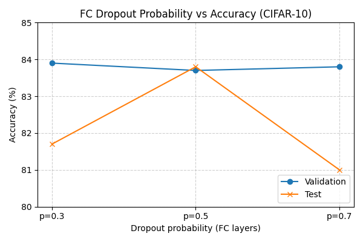

# Notebooks Guide
This folder contains all experiment notebooks. Each notebook isolates one idea, but together they show the progression of experiments.

---

## 📂 Index
**01_baseline.ipynb**  
- Purpose: Baseline CNN with standard augmentations only. Serves as the reference point for all experiments.
- Key Findings: Validation accuracy of 82.4% (test 81.8%).  

**02_fc_dropout.ipynb**  
- Purpose: Add dropout only to fully connected layers.  
- Key Findings: Validation accuracy improved to 83.8% (test 83.7%).  

**03_conv_dropout.ipynb**  
- Purpose: Add dropout only to convolutional layers.  
- Key Findings: Validation accuracy reached 85.0% (test 83.3%). Conv dropout produced the strongest regularization effect, improving validation accuracy but slightly lowering test accuracy compared to FC dropout.

  
  
   
  <em>Figure 1: Validation/test accuracy across dropout probabilities. Left: FC dropout. Right: Conv dropout.</em>

**04_cutout.ipynb**  
- Purpose: Apply cutout augmentation to the baseline CNN.  
- Key Findings: Validation accuracy 84.0% (test 84.0%). Cutout matched or exceeded dropout in test accuracy, highlighting augmentation’s effectiveness over architectural regularization.

  
   
  <em>Figure 2: Validation/test accuracy across cutout sizes.</em>

---

  
   
  <em>Confusion matrix of best performing model.</em>

## 🔎 Notes
- Each notebook includes result tables comparing against the baseline.  
- Multiple dropout probabilities and cutout sizes were tested; only the best-performing settings are reported here.
- **Comparison:** Dropout in convolutional layers gave the highest validation accuracy. Cutout matched dropout in test accuracy, showing its strength as a data augmentation technique.

  
   
  <em>Figure 3: Histogram of activations under dropout, showing zeroed outputs.</em>

